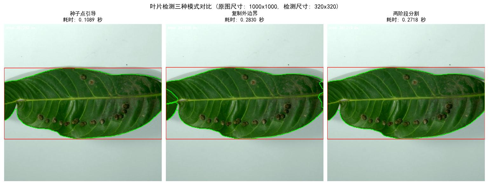

# Leaf-PreLabel: 基于 GrabCut 优化的叶片快速预标注工具

[](https://www.python.org/downloads/)
[](https://opencv.org/)
[](https://opensource.org/licenses/MIT)

Leaf-PreLabel 是一款专为植物叶片图像设计的**自动化预标注工具**。它能显著减少深度学习数据集构建中的人工标注工作量，帮助研究人员和开发者快速生成高质量的 YOLO 格式标签。

---

## 📌 项目背景

在植物病虫害识别等计算机视觉任务中，高精度模型的训练需要大量带精确边界框的叶片图像。传统人工标注一张图需要 5~10 秒，数据标注工作量巨大。

Leaf-PreLabel 通过优化 GrabCut 算法，实现了叶片的快速自动标注，尤其解决了以下痛点：

- **贴边叶片切断问题**：当叶片紧贴图像边缘时，传统 GrabCut 矩形初始化会把叶片部分切除。本工具通过**种子点引导**或**复制外边界**的策略完美解决。
- **病害导致的颜色不均**：叶片病斑、虫洞、枯死区域不影响标注完整性。
- **背景复杂**：通过多种分割模式适应不同复杂度背景。

---

## 🎯 核心方法

本工具基于 GrabCut 图割算法，提供三种分割模式，用户可根据图像特点灵活选择：

### 1. Seed（种子点引导）
- **原理**：OTSU 二值化自动定位叶片质心，以此为中心构建种子掩膜（确定前景 + 可能前景），执行单阶段 GrabCut 迭代。
- **适用场景**：背景简单、叶片与背景颜色对比明显的图像。

### 2. Padding（边缘复制）
- **原理**：将图像边缘向外复制 10 像素，用矩形框精确包裹原图区域，执行单阶段 GrabCut 迭代。
- **适用场景**：背景复杂的图像。

### 3. Twostage（两阶段分割）
- **原理**：第一阶段用矩形留边 5% 做粗分割并计算叶片质心；第二阶段基于质心构建种子掩膜，执行精细分割。
- **适用场景**：背景复杂的图像。

---

## 📂 项目结构

```
Leaf-PreLabel/
├── src/                           # 核心源代码
│   ├── main.py                    # 主程序入口（带交互界面）
│   ├── leaf_detector.py           # 核心分割器（三种模式实现）
│   ├── batch_YOLO_labeler.py      # 批量标签生成器
│   ├── cv_utils.py                # OpenCV 辅助函数（自适应 GrabCut）
│   └── leaf_detector_demo.py      # 单张图片调试与可视化脚本
├── data/raw/                      # 原始图片输入目录（按类别分文件夹）
│   ├── Healthy/
│   │   └── sample.jpg             # 简单背景示例图片
│   ├── GallMidge/
│   │   └── sample.jpg             # 简单背景示例图片
│   └── leave/                     # 复杂背景示例图片
│       ├── sample1.jpg            # 3种方法均能分割
│       └── sample2.jpg            # 方法1分割失败（用于测试容错）
├── outputs/labels/                # 生成的 YOLO 标签自动保存于此
├── requirements.txt               # Python 依赖清单
└── README.md                      # 项目说明
```

---

## 🚀 快速开始

### 环境要求
- Python 3.10 
- 建议使用 Conda 虚拟环境

### 安装依赖
```bash
pip install opencv-python numpy matplotlib
```

### 运行批量标注
1. 在终端中进入项目根目录：
   ```bash
   cd Leaf-PreLabel
   ```
2. 执行主程序：
   ```bash
   python src/main.py
   ```
3. 按提示操作：
   - **选择图片文件夹**（例如 `data/raw/Healthy`）
   - **输入 YOLO 类别编号**（如健康叶片输入 `0`）
   - **选择分割模式**（根据图片特点选择 1、2 或 3）

生成的 `.txt` 标签文件将自动保存在 `outputs/labels/` 目录下，按输入文件夹名称分类存放。

---

## 🖥️ 交互界面示例

运行 `main.py` 后，终端会显示清晰的分步引导：

```
请选择包含叶片图片的文件夹
请输入该类别对应的 YOLO 编号 (例如 Healthy → 0): 0

==================================================
请选择分割模式：
==================================================
1. seed (种子点引导)
   - 原理：OTSU 二值化找质心，构建种子掩膜，单阶段 GrabCut
   - 特点：适用于背景简单、叶片与背景对比明显的图片
--------------------------------------------------
2. padding (边缘复制)
   - 原理：图像边缘向外复制 10 像素，用矩形框包裹原图
   - 特点：可处理叶片紧贴图像边缘的情况
--------------------------------------------------
3. twostage (两阶段分割)
   - 原理：粗分割找质心 → 细分割精细化
   - 特点：可处理背景复杂的情况
==================================================
请输入数字选择模式 (1/2/3): 
```

---

## 📷 效果展示

运行 `leaf_detector_demo.py` 可单张测试，直观对比三种模式的分割效果：

```bash
python src/leaf_detector_demo.py
```




---

## 🛠️ 技术细节

### 加速策略
- **下采样加速**：图片大于 320×320 时自动缩小，GrabCut 计算量大幅降低。
- **自适应迭代**：当掩膜变化小于 0.5% 时提前终止迭代，避免不必要的计算。
- **容错机制**：当颜色不可分时自动回退到 HSV 颜色分割，保证程序稳定运行。

### 输出格式
- 严格遵循 YOLO 格式：`class_id x_center y_center width height`
- 坐标归一化到 0~1 范围，可直接用于 YOLO 系列模型训练。

---

## 🤝 贡献与反馈

欢迎提交 Issue 或 Pull Request。如有问题，请在 GitHub 仓库中提出。

---

## 📄 许可证

本项目采用 [MIT License](LICENSE)。